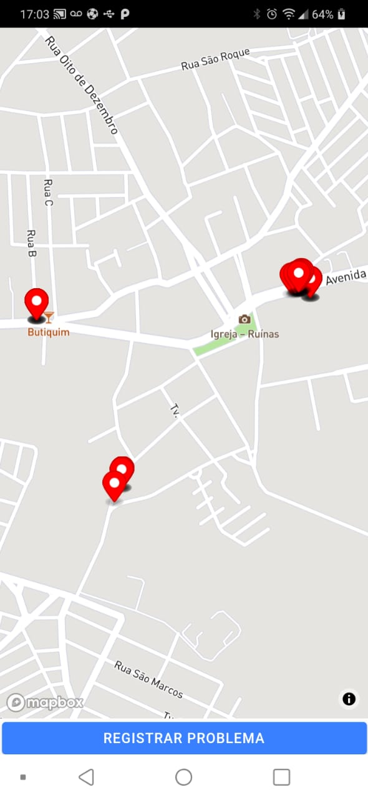

# Problemas na Cidade :construction: 

Esse é um projeto pessoal que visa criar uma solução para registro de problemas de infraestrutura nas cidades. 
O projeto vai englobar todas as partes API, App Mobile e Web.
Com o App Mobile é será possivel cadastrar o problema e adicionar fotos, localização e descrição. 
Na aplicação Web funcionara como um *back office* onde o responsavel tomara as medidas e respondera ao problema.

## [API](ttp://problemascidade.duckdns.org/api)

O backend em sua primeira versão pode ser acessado esse
[aqui](https://github.com/jpbbrito/backend-api-pc). Esse foi implementamentado com o framework NestJS, documentação utilizei o Swagger e o banco de dados Oracle Autonomous Database. Toda hospedagem está no Oracle Cloud. 
## Web

O *back office* só começa após sera finalizado o App, sua construção sera feito com Angular.

## App Mobile

O Aplicativo está sendo construido com Ionic 5 com Capacitor. O sistema de mapas é [MapxBox](https://www.mapbox.com/). Esse é esta em fase final de construção.

